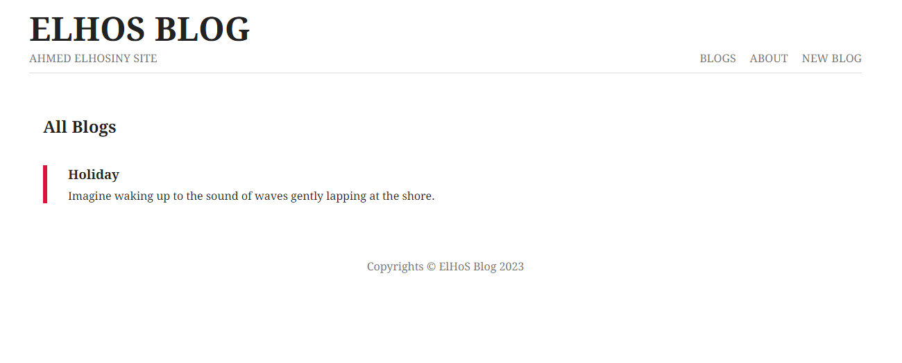
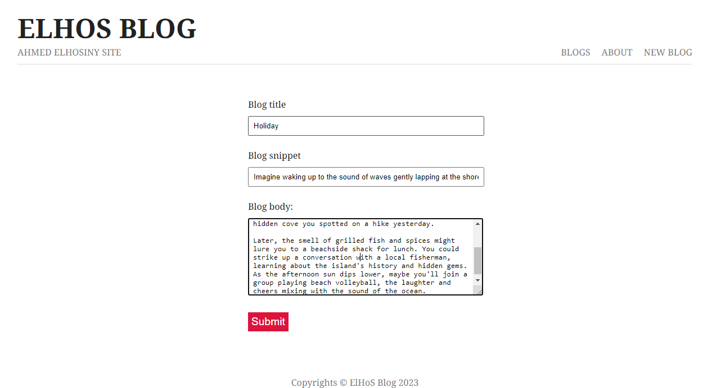

# Blog API

This repository implements a RESTful API for a blog application using Express.js, Mongoose, and EJS as the template engine. It adheres to the Model-View-Controller (MVC) architecture for a well-organized code structure.

## Features
* Users can create blog posts with title, snippet, and full body content.
* Users can view a list of all their blog posts.
* Users can view the full content of an individual blog post.

## Technologies
* Express.js: A Node.js framework for building web applications and APIs.
* Mongoose: An ODM (Object Data Modeling) library for interacting with MongoDB databases.
* EJS: A simple and efficient templating engine for generating HTML responses.

## Installation
1. Clone the repository:
   ```bash
   git clone https://github.com/Ahmed-Elhosiny/Blogs.git
2. Install dependencies:
   ```bash
   npm install
## Usage
1. Start the server:
   ```bash
   node server
   
2. Visit your blog home
   ```bash
   http://localhost:4000/blogs

3. Create new blog


